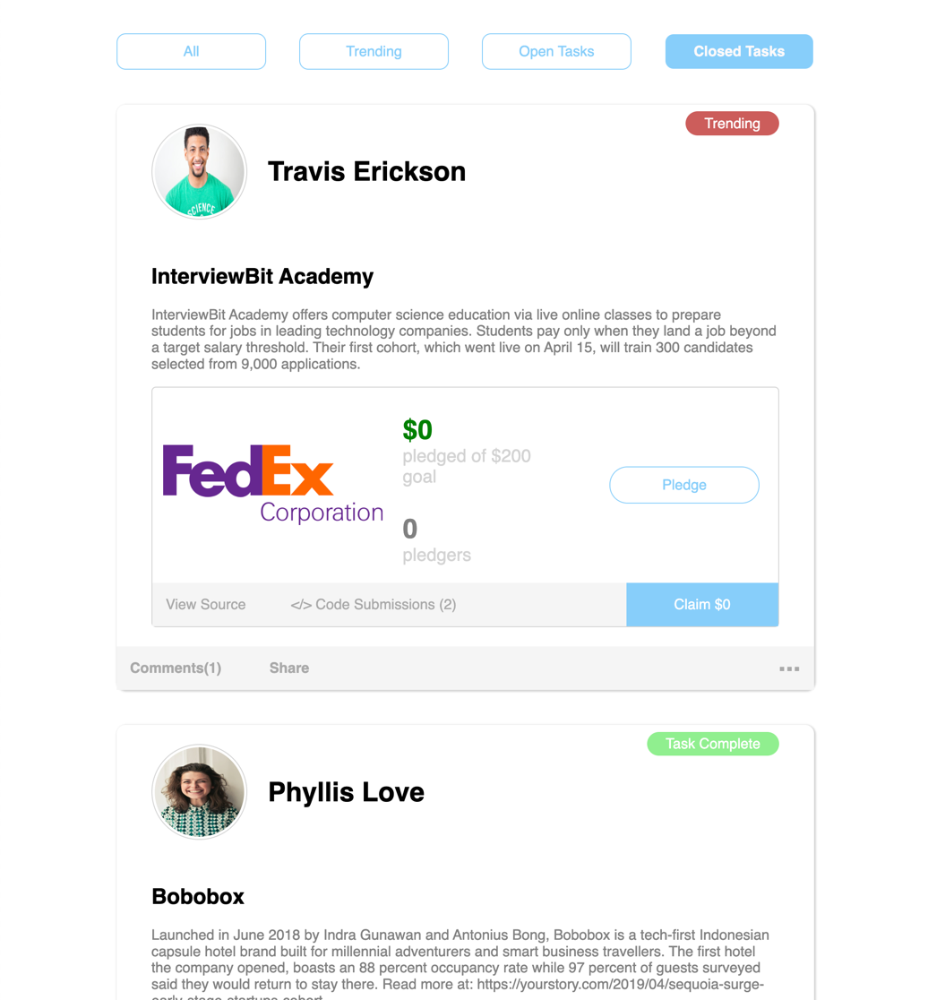

# React GraphQL Assignment

## Stack
 - React
 - Typescript
 - GraphQL

## Server
Mock-Server is located in `server` directory. Contains a simple GraphQL server and readonly fs mocked database.

### Start
```shell
cd server
```
```shell
yarn
```
```shell
yarn start
```
It should output something like 
```shell
🚀  Server ready at http://localhost:8000/
```
Server will use random delay on every request, so it can simulate heavy load, race conditions on concurrent requests, etc.

### GQL TYPES
```
type Author {
    name: String
    picture: String
    title: String
    score: Float
  }

  enum Status {
    CLOSED
    OPEN
  }

  type SocialEntity {
    author: Author!
    date: String!
    popularity: Float!
    isTrending: Boolean!
    title: String!
    description: String!
    numComments: String!
    thumbnail: String!
    codeSubmissionTotal: Int!
    pledgeTotal: Float!
    pledgerCount: Float!
    pledgeGoal: Float!
    status: Status!
  }

  type GetEntitiesResult {
    result: [SocialEntity]
    hasMore: Boolean
  }

  input Filter {
    isTrending: Boolean
    status: Status
  }

  type Query {
    getEntities(sortBy: [String], limit: Int, page: Int, filter: Filter): GetEntitiesResult
  }
```

## Assignment

Build react application that displays the list of social entities using `getEntities` query.

### Requirements
- Implement Proper UI

- Posts should be filterable by `status`, and `isTrending` (by running query - not purely on UI)
- Implement pagination in a form of infinite scroll (preferably without using any library)
- Implement skeleton card components for loading indication
